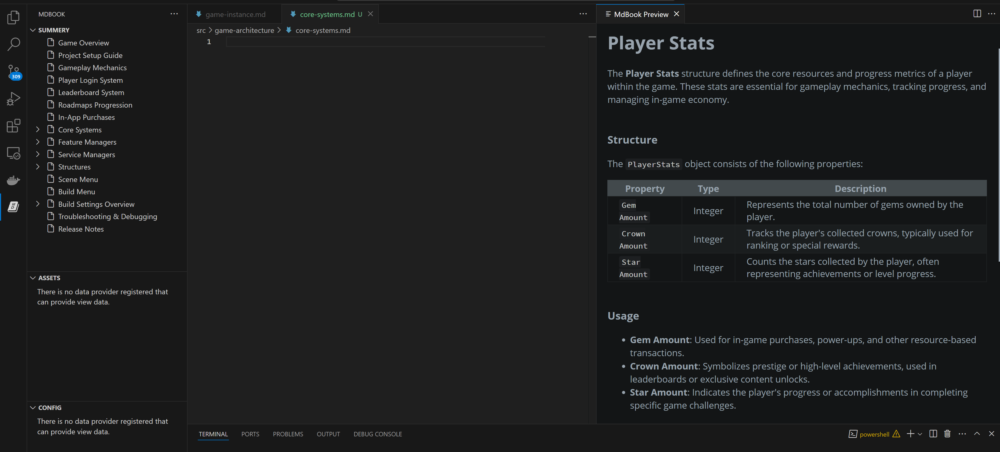

# mdbook-vscode README

This is the README for your extension "mdbook-vscode". Below is a brief description of its features and functionality.

## Features

- Automatically updates the summary file
- Internal mdbook preview
- Helper commands for working with `mdbook.exe`

## How It Works

## Under Development

- Some features are still being developed, including the explorer and preview functionality. Please be cautious as they may not be fully stable yet.
- This extension is currently under development. Expect frequent updates and potential changes in functionality.